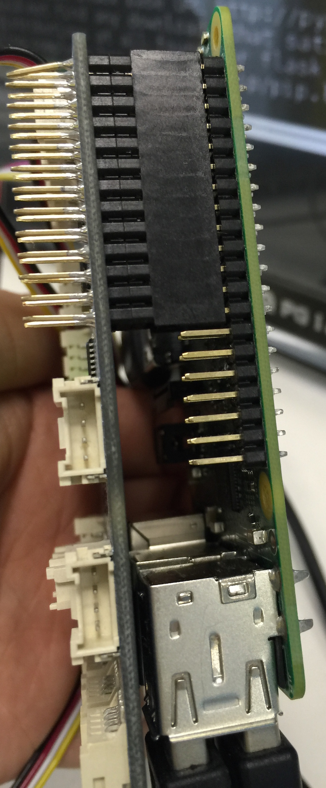
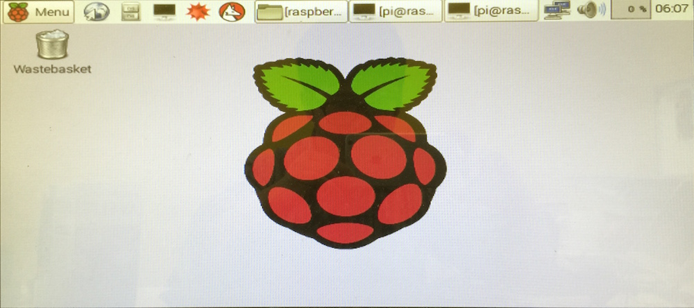
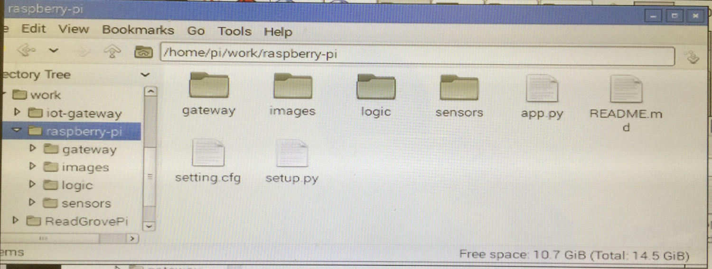
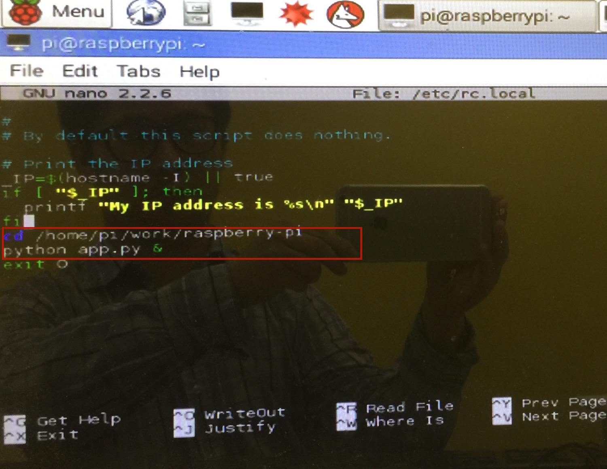
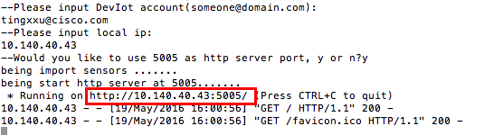

#RaspberryPI Gateway#
RaspberryPi gateway service can be used to work with [DevIoT](https://developer.cisco.com/site/devnetlabs/deviot/), supply the DevIot capability with read sensor data, control sensor status, define sensor action 

This code also can be as a sample code to show how to use the Gateway Service SDK, use it build a completed gateway service which can work with DevIot

This guide will show how to build this sample step by step

## Table of contents

* [What in this code](#what-in-this-code)
* [Prerequisite](#prerequisite)
* [How to use](#how-to-use)
* [How to test ](#how-to-test )
* [Getting help](#getting-help)

## What in this code
1.the app.py: the app entry

2.setting.cfg: the custom's setting file, you can put all you setting item in this file with json format

3.setup.py file: this file will help you install some dependency lib for this sample

4.sensors folder: contain all the sensor logic model, those model map to real sensor connected to the Pi

5.logic folder: contain some custom logic, such as how to get the data from GrovePi and how to use the data update the sensor

##Prerequisite
###Hardware###
1.This sample depended on [Raspberry-Pi](https://www.raspberrypi.org/), you can get this pi device from [here](http://www.amazon.com/Programming-Raspberry-Pi-Second-Getting-ebook/dp/B015K0URT8/ref=sr_1_1?s=digital-text&ie=UTF8&qid=1458615397&sr=1-1&keywords=raspberry+pi)

2.This sample use [GrovePi+ Starter Kit](http://www.dexterindustries.com/grovepi/), you can get this device from[here](http://www.amazon.com/Dexter-Industries-GrovePi-_Starter-Starter/dp/B00TXTZ5SQ/ref=sr_1_1?s=toys-and-games&ie=UTF8&qid=1458615492&sr=1-1&keywords=grovepi+starter+kit).

3.SD card for Raspberry Pi, Power adapter(5V), USB cable, Network cable, HDMI cable, Display with HDML interface

###Software###
4.This sample code need meet all Prerequisites the in [Prerequisite](https://cto-github.cisco.com/tingxxu/iot-gateway/blob/master/README.md)

5.GrovePi SDK

##How to use
###Build the hardware###

1.Prepare your RaspberryPi os environment in your SD card

* Download the OS for RaspberryPi form here[RASPBIAN JESSIE](https://www.raspberrypi.org/downloads/raspbian/)

* Format you SD card

* Use window install the OS image to the SD card. you can use [Win32 Disk Manager](https://sourceforge.net/projects/win32diskimager/) do this 
    I strongly recommend you do this use windows, i have met many issues when i installed it by mac os

* Attach the SD card to the RaspberryPi

You also can do this follow [here](https://www.raspberrypi.org/documentation/installation/noobs.md)

2.Join the GrovePi with RaspberryPi. if you correct, it should be like this

3.Connect RaspberryPi with the power and network.

4.Connect RaspberryPi with Display use the HDMI cables.

if you finished the above steps, in your display，you should look the RaspberryPi OS interface.

###Build the software environment###
5.Install the Python 2.7. Check the python version of RaspberryPi os. this sample code base on python2.7.3 or later. in most time, the RaspberryPi os have installed the python2.7.3 or later, if not, you can 
install the python follow [here](https://www.raspberrypi.org/documentation/linux/software/python.md)

6.Install GrovePi SDK.

* Make sure your Raspberry Pi is connected to the internet. 
 
* Type follow command in terminal window
    
        sudo apt-get update
        sudo apt-get install rpi.gpio
    
*[Follow this tutorial for setting up the GrovePi](http://www.dexterindustries.com/GrovePi/get-started-with-the-grovepi/setting-software/).

* Restart the Raspberry Pi.
    
Your SD card now has what it needs to start using the GrovePi!
[Here is info more about install GrovePi SDK](http://www.dexterindustries.com/GrovePi/get-started-with-the-grovepi/)

###Use sample code directly###
7.Prepare the code.Download this sample code and the [gateway code](https://cto-github.cisco.com/tingxxu/iot-gateway/tree/master/gateway). copy the gateway folder into the raspberry-pi folder. 
In your workspace should like this:

8.Install the dependency.Run the setup.py file use follow command:
    
    sudo python setup.py develop

this script will install "flask","paho-mqtt" lib for this sample

9.Connect the sensors to GrovePi and configuration.

In this sample, we connect one button sensor to A0 port,one sound sensor to A1 port, one light sensor to A2 port ,one led sensor to D3 port and one buzzer sensor to D4 port.

The port number with A prefix means it is readable pin port, you just can read data, the D prefix means you just can write data to this pin port.

Check the connection setting in setting.cfg, the setting.cfg file should like this:

    {
        "address":"10.140.92.25:9000",                  #required, it is DevIot platform server address, format should be: ip:port
        "mqtthost":"10.140.92.25:1883",                 #required, it is the DevIot platform MQTT server address, format should be: ip:port
        "communicator": "MQTT",                         #optional, the way about connect the server, MQTT or HTTP, by default the value will be "MQTT"
    
        "appname":"raspberry",                          #optional, the name of you gateway service app, it should not be empty, by default the value will be "arduino".
        "account":"",                                   #optional, your account of DevIot platform, most of the time,it should be a mail address, by default it will be empty, it means this gateway will be used for all DevIot users
    
        "sensors": {                                    #required, you need register you sensor information in here, if you don't have any sensor, keep it empty
            "button_r":                                 #required, sensor id is the identify id for the sensor, we suggest that you named a sensor as this format: kind_fix
                {
                    "name":"RButton",                   #required, name is display name of sensor in DevIot platform
                    "kind":"button",                    #required, kind is the a type identifier of sensor
                    "pin": 0,                           #required, connect to the A0 port
                    "type": "data"                      #required, it means A0 is readable
                },
                "sound_r":                              
                {
                    "name":"RSound",                    
                    "kind":"sound",                     
                    "pin": 1,                           
                    "type": "data"                      
                },
                "light_r":                             
                {
                    "name":"RLight",                    
                    "kind":"light",                     
                    "pin": 2,                           
                    "type": "data"                      #necessary, it means A2 is readable
                },
                "led_r":                                #necessary, sensor id is the identify id for the sensor, we suggest that you named a sensor as this format: kind_fix
                {
                    "name":"RLed",                      #necessary, name is display name of sensor in DevIot platform
                    "kind":"led",                       #necessary, kind is the a type identifier of sensor
                    "pin": 3,                           #necessary, connect to the D3 port
                    "type": "action"                    #necessary, it means D3 is writeable
                },
                "buzzer_r":                             #necessary, sensor id is the identify id for the sensor, we suggest that you named a sensor as this format: kind_fix
                {
                    "name":"RBuzzer",                   #necessary, name is display name of sensor in DevIot platform
                    "kind":"buzzer",                    #necessary, kind is the a type identifier of sensor
                    "pin": 4,                           #necessary, connect to the D4 port
                    "type": "action"                    #necessary, it means D4 is writeable
                }
            }
    }
    
make sure the content(without the comment) in setting.cfg file is json format, you can check it in [here](https://jsonformatter.curiousconcept.com/)
    
you can add or remove the sensor segment in "sensors" segment in setting.cfg file by your requirements.

Please do not let multiple sensors use same pin.

10.Configure the code to let the gateway auto run when RaspberryPi started.
    
* Open the terminal window and type follow command to open the rc.local file by nano:
    
        sudo nano /etc/rc.local
* Add follow command to rc.local file:
        
        cd /{your code directory}
        python app.py &
        
Here is a sample:

    

* Press ctrl + o to save rc.local file then close the rc.local file.
    
11.Start the gateway.
For this purpose, you have two choices: one is restart the RaspberryPi, once the RaspberryPi started, the gateway will run automatically, another is that:
Open the terminal window and cd to workspace folder, type follow command to run it
    
    python app.py 

##How to test
If in your setting.cfg file, you use MQTT as the communicator, you can use [mqtool to test you service](https://cto-github.cisco.com/tingxxu/iot-gateway/tree/master/tools)

if you use HTTP protocol, you can use postman to test your service:

* open the HTTP RESTfull API document by open the link shown in you terminal window:
    
    
    
* Use [PostMan](https://chrome.google.com/webstore/detail/postman/fhbjgbiflinjbdggehcddcbncdddomop?hl=en) to test those API.

##Troubleshoting
* Error info contain the "config": 

    1. Check the if the content(without the comments) in setting.cfg is Json format. you can check it in [here](https://jsonformatter.curiousconcept.com/)
    2. Check the all the necessary section in the setting.cfg. 

* Error info contain the "input/output" or "can't read" or "analogRead":
    1. Check if the GrovePi SDK installed successfully, you can check it by typing follow command in terminal window:
        
        python                          #start the python 
        from grovepi import grovepi
    if there is some wrong, then type follow command:
        
        import grovepi
        grovepi.analogRead(0)
        
    if there is still something wrong, it means you  GrovePi SDK did not installed correctly.
    

##Programing with gateway sdk##
if you want to know how to use the gateway sdk to program this sample, you can follow bellow steps:

1.Download the gateway folder and copy it into you workspace folder

2.Configuration:Create a new file named setting.cfg in your workspace folder, then you can follow the relation between sensor and GrovePi port, code the setting item like this:
     
     "button_r":                                 #necessary, sensor id is the identify id for the sensor, we suggest that you named a sensor as this format: kind_fix
         {
             "name":"RButton",                   #necessary, name is display name of sensor in DevIot platform
             "kind":"button",                    #necessary, kind is the a type identifier of sensor
             "pin": 0,                           #necessary, connect to the A0 port
             "type": "data"                      #necessary, it means A0 is readable
         }
it means the button sensor connect to the O port and the pin is readable(AO port)

we can also set the DevIot platform address in this file. it is better to organize those settings with JSON format. 

when we finished those setting, the setting.cfg file should be like this:
    
    {
    "address":"10.140.92.25:9000",
    "mqtthost":"mqtt.cisco.com",
    "mqttport":7777,
    "sensors": {
        "button_r":
        {
            "name":"RButton",
            "kind":"button",
            "pin": 0,
            "type": "data"
        },
        "sound_r":
        {
            "name":"RSound",
            "kind":"sound",
            "pin": 1,
            "type": "data"
        },
        "light_r":
        {
            "name":"RLight",
            "kind":"light",
            "pin": 2,
            "type": "data"
        },
        "led_r":
        {
            "name":"RLed",
            "kind":"led",
            "pin": 3,
            "type": "action"
        },
        "buzzer_r":
        {
            "name":"RBuzzer",
            "kind":"buzzer",
            "pin": 4,
            "type": "action"
        }
    }
}

3.Create app entry: create a new python file as the app entry in your workspace, i named this file as "app.py". in this file, typing follow code:

    from gateway.service import Service
    from gateway.config import config

    if __name__ == '__main__':
    
         devIot_address = config["address"]

        app = Service("raspberry", devIot_address, False)

        # if you want to use MQTT protocol, please set the mqtt_server address and port to app
        app.mqtt_server = config["mqtthost"]
        app.mqtt_port = config["mqttport"]
        app.run()

In above code, we instance a new Service, pass the DevIot address to this instance, and named this app as "raspberry". the third parameter is used to indicate if this app is support multiple user, the real sensor can not support multiple request, so we set this parameter as false.

4.Operate the GrovePi.
Add a new folder named "logic"(whatever you like), add a new python file named as "grovepioperator" under this folder, type follow code to this file:

    from gateway.pioperator import PiOperator

    import os
    import random
    
    analog = 'analog'
    digital = 'digital'
    input_fix = 'INPUT'
    output_fix = 'OUTPUT'
    
    is_debug = False
    if "DEBUG" in os.environ:
        is_debug = os.environ['DEBUG'] == 'TRUE'

    class GrovePiOperator(PiOperator):
    
        @staticmethod
        def write(pin, data):
            if is_debug is False:
                from grovepi import grovepi
                grovepi.pinMode(pin, output_fix)
                grovepi.digitalWrite(pin, data)
            else:
                print("write data..." + str(data))
    
        @staticmethod
        def read(pin):
            if is_debug is False:
                from grovepi import grovepi
                data = grovepi.analogRead(pin)
                return data
            else:
                return random.randint(0, 100)
                
in above code, first you should create your own Pi Operator by inherit the PiOperator class and implement the write and read method. those two method use GrovePi sdk to read/write data from/to PI.
I add is_debug variable to let this app can run without the GrovePI device, if the is_debug is True, the read method just return some random data and the write method just put out some log

5.Add sensor model and logic. 

create a new folder and which should be named "sensors".

after above steps, your workspace should like this:

in the sensor folder, create a new python file named "temperature",add the follow code to this file:
    
    from gateway.sensor import Sensor
    from gateway.sproperty import SProperty
    from gateway.config import config
    from gateway.sensorlogic import SensorLogic
    from logic.grovepioperator import GrovePiOperator
    
    
    sound = Sensor("sound", "sound_1", "RSound")
    
    value_property = SProperty("volume", 0, [0, 100], 0)
    
    sound.add_property(value_property)
    
    
    class SoundLogic(SensorLogic):
        pin = config["sensors"]['sound_r']['pin']
    
        @staticmethod
        def update(sensor, data):
            pin = config["sensors"][sensor.id]['pin']
            new_value = GrovePiOperator.read(pin)
            updated_properties = {"volume": new_value}
            SensorLogic.update_properties(sensor, updated_properties)
            
In above code:

* we use Sensor class to create a sound sensor model, and define a value with SProperty class. 

* we create a static class named "SoundLogic" which inherit from SensorLogic and override the update method, in this method we use the GrovePiOperator to read the data from the real sound sensor.

you need get more detail from GrovePi sdk to know how to covert the raw sensor data to real data.

you can repeat above step to create other sensors

6.Add the __init__.py file in logic and sensor folder to make other file can refer to the code in those two folder.

## Getting help

If you have questions, concerns, bug reports, etc, please file an issue in this repository's Issue Tracker

## Getting involved

For general instructions on _how_ to contribute, please visit [CONTRIBUTING](CONTRIBUTING.md)

## Open source licensing info

1. [LICENSE](LICENSE)

## Credits and references

None